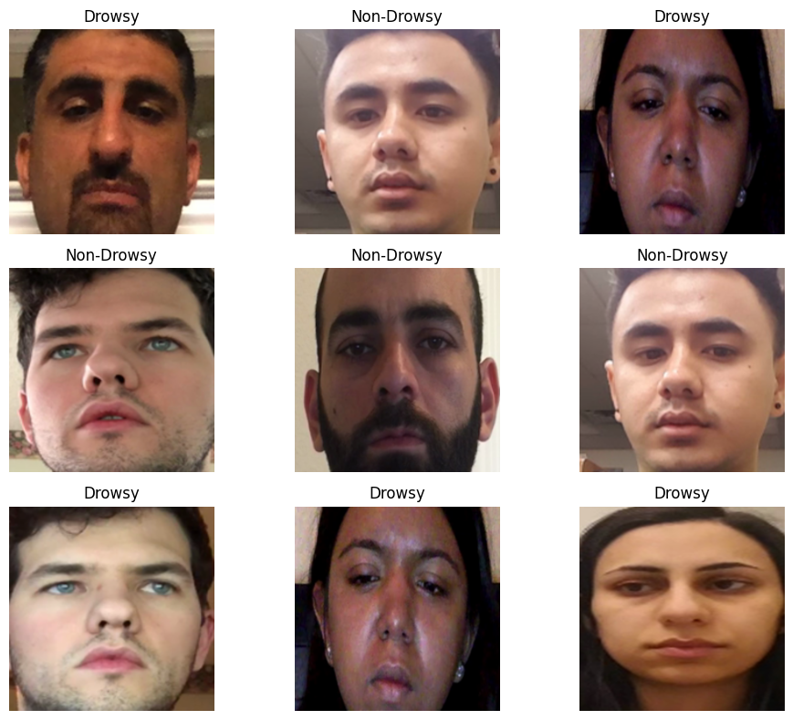
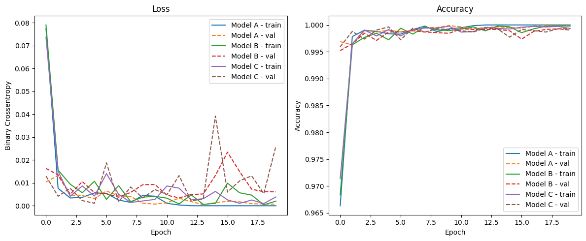
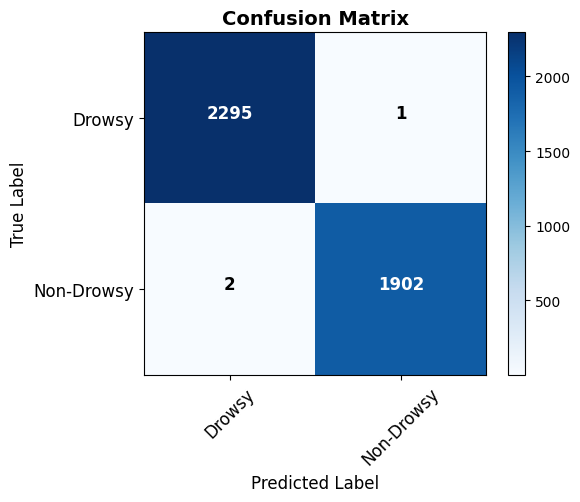
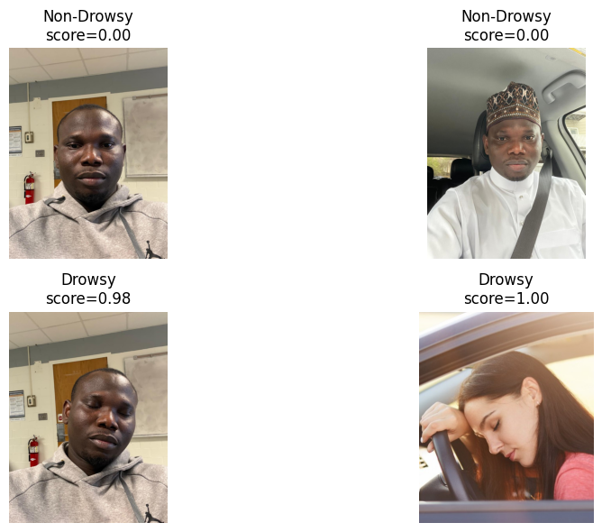

# Drowsiness Detection Using Deep CNN

## Overview

This repository contains a deep learning project on **drowsiness detection from facial images** using Convolutional Neural Networks (CNNs).

The project was originally completed in **Fall 2025** as part of the **CpE520 – Application of Neural Networks** course at West Virginia University and was later archived on GitHub.

The objective was to classify facial images into two categories:

- **Drowsy**
- **Non-Drowsy**

Three CNN architectures of increasing depth were designed, trained, and evaluated to determine which architecture provided the strongest performance for binary drowsiness classification.

## Dataset

The study used a curated dataset of **41,832 facial images** collected from:

- the Ismail Nasri Driver Drowsiness Dataset on Kaggle
- additional publicly available images from the web

The data was divided into:

- **70% training**
- **20% validation**
- **10% testing**

After preprocessing, the final dataset contained:

| Class | Training | Validation | Testing |
|---|---:|---:|---:|
| Drowsy | 14,056 | 4,016 | 2,296 |
| Non-Drowsy | 12,286 | 3,510 | 1,904 |
| **Total** | **26,342** | **11,289** | **4,200** |
### Sample Dataset Images

The following figure shows representative samples from the drowsiness detection dataset.

## Preprocessing

The preprocessing pipeline included:

- corrupted-image removal
- resizing images to **256 × 256**
- normalization to the range **[0, 1]**
- random horizontal flipping
- slight image rotations
- brightness adjustments
- shuffling and batching using the TensorFlow `tf.data` pipeline

## CNN Architectures

Three CNN variants were evaluated.

### Model A — Baseline CNN

- Conv2D(16) + MaxPooling
- Conv2D(32) + MaxPooling
- Conv2D(16) + MaxPooling
- Flatten
- Dense(256)
- Dense(1, Sigmoid)

Total parameters: **3,696,625**

### Model B — Deeper CNN

- Conv2D(32)
- Conv2D(64)
- MaxPooling
- Dropout(0.5)
- Dense layers with ReLU activation
- Sigmoid output

Total parameters: **7,411,169**

### Model C — Deepest CNN

- Conv2D(32)
- Conv2D(64)
- Conv2D(64)
- Dense(512)
- Dropout(0.5)
- Sigmoid output

Total parameters: **29,548,545**

## Training Configuration

All three models were trained under the same configuration:

- **Framework:** TensorFlow / Keras
- **Optimizer:** Adam
- **Loss function:** Binary Cross-Entropy
- **Epochs:** 20
- **Batch size:** 32
- **Environment:** Google Colab with GPU acceleration

## Model Comparison

| Model | Training Accuracy | Training Loss | Validation Accuracy | Validation Loss |
|---|---:|---:|---:|---:|
| Model A | 1.0000 | 1.3646e-07 | 0.9999 | 6.7696e-04 |
| Model B | 0.9998 | 0.0014 | 0.9993 | 0.0061 |
| Model C | 0.9992 | 0.0047 | 0.9990 | 0.0261 |

Model A achieved the strongest overall performance despite being the simplest of the three architectures.
### Training and Validation Performance

The training and validation curves for the three CNN architectures are shown below.

## Final Test Performance

The best-performing model, **Model A**, achieved:

- **Accuracy:** 99.93%
- **Precision:** 99.95%
- **Recall:** 99.89%

The confusion matrix showed only a very small number of misclassifications across the test set.

### Confusion Matrix

The confusion matrix below shows the classification performance of the best-performing CNN on the held-out test dataset.

## External Image Testing

The final model was also evaluated using four previously unseen images that were not part of the training, validation, or testing datasets.

All four external images were classified correctly with high confidence.
### Predictions on Previously Unseen Images

The following figure shows predictions made on external images that were not included in the training, validation, or test datasets.

## Key Findings

- A relatively compact CNN achieved stronger performance than the deeper alternatives.
- Increasing model depth did not improve classification accuracy for this dataset.
- Proper preprocessing and augmentation contributed to stable model performance.
- The final CNN achieved high accuracy, precision, and recall on the held-out test set.
- The model also produced correct predictions on the external test images used in the experiment.

## Technologies

- Python
- TensorFlow
- Keras
- NumPy
- Matplotlib
- Google Colab
- Deep Learning
- Convolutional Neural Networks

## Repository Contents

- `Drowsiness_Detection_using_DeepCNN.ipynb` — complete executable notebook containing preprocessing, CNN architectures, training, evaluation, visualizations, and external image testing.
- `README.md` — summary of the project, methodology, and experimental results.

## Project History

**Original project period:** Fall 2025  
**GitHub archival date:** 2026

This repository contains work originally completed during the Fall 2025 semester and later archived on GitHub as part of a personal academic and technical portfolio.

## Limitations

The dataset may not fully represent the diversity of real-world driving environments, including broader variation in lighting conditions, facial appearance, camera quality, and demographic representation.

The model was also evaluated primarily using individual facial images rather than explicit temporal sequences such as continuous blink patterns.

## Future Work

Possible extensions include:

- LSTM or Temporal CNN models for time-dependent drowsiness cues
- Vision Transformers
- Vision-Language Models
- real-time deployment on embedded hardware such as NVIDIA Jetson
- evaluation under more varied real-world driving conditions

## Conclusion

This project demonstrates that a carefully designed CNN can achieve highly accurate binary drowsiness classification without requiring an excessively deep architecture. In this experiment, the simpler Model A outperformed the deeper CNN variants while maintaining strong performance across training, validation, testing, and the limited external-image evaluation.
